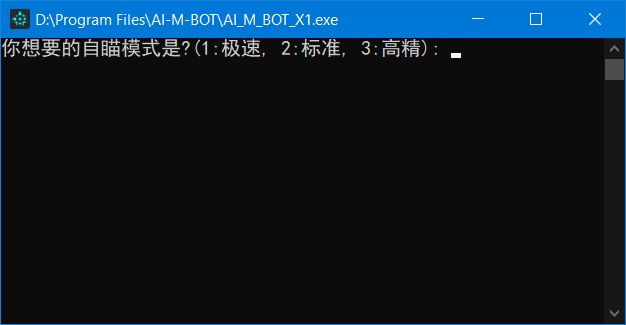
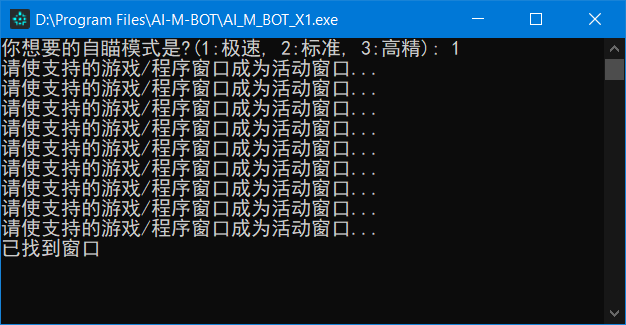
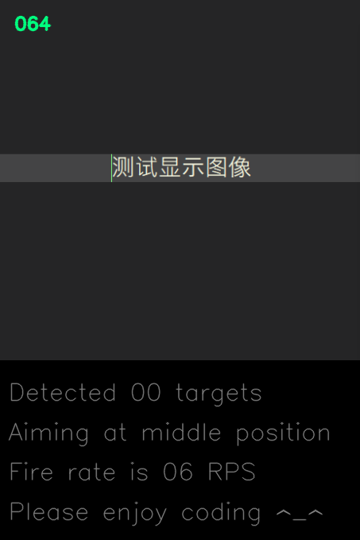

# I AM BOT========================AI-M-BOT

[](https://996.icu/#/zh_CN)  [](https://996.icu/#/en_US)  [](https://github.com/996icu/996.ICU/blob/master/LICENSE_CN)  [](https://github.com/996icu/996.ICU/blob/master/LICENSE)

[](https://github.com/JiaPai12138/AI-M-BOT)  [](https://github.com/JiaPai12138/AI-M-BOT)  [](https://github.com/JiaPai12138/AI-M-BOT)  [](https://github.com/JiaPai12138/AI-M-BOT/releases)  [](https://github.com/JiaPai12138/AI-M-BOT/blob/main/LICENSE)  [](https://github.com/JiaPai12138/AI-M-BOT/blob/main/使用说明.rtf)

`YOLOv4-tiny and OpenCV-gpu based aimbot powered up by multiprocessing`
```
1, 本作者不对任何由本开源软件造成的任何问题(包括封号)负责。。。
2, 本开源免费软件为学习/娱乐之用，禁止贩卖，欢迎参与改进。。。
3, 本人所在战队为正规战队，除本人外皆游戏技艺娴熟之辈。。。
4, 本人对本瞎几把不专业申明拥有最终解释权，哈哈。。。
5, 没有惊喜，没有意外。。。
```

* 使用自瞄时请将游戏分辨率调整至<font style="background: #FFFF00">1600*900</font>及以下，将画面效果调整至<font style="background: #FFFF00">中等</font>及以下
* 需要计算能力6.1及以上版本的<font style="background: #FFFF00">N卡</font>以及安装相应驱动，详情请见[CUDA wiki](https://zh.wikipedia.org/wiki/CUDA)
* 按1或2或3或4选择自瞄模式(图像预测尺寸递增，预测速度递减)
* 等待游戏窗口成为当前活动窗口(点击一下游戏窗口即可)
* 脚本正常工作时桌面左上角会显示截屏识别区域小视频
* 按"1"/"2"键保持自瞄状态并控制鼠标
* 按"3"/"4"键保持自瞄状态但不控制鼠标
* 按"p"键重启程序
* 按"END"结束程序
* 自瞄只截屏识别准星附近区域，对于16:9的CF游戏窗口识别区域大小为(高=游戏窗口高*1/2，宽=高*4/3)
* 本程序使用python语言以及自源码编译的opencv-cuda加速库
* 本程序目前使用yolov4-tiny模型，只因其快(目前使用b站大佬[VeniVediVeci](https://space.bilibili.com/196421117)训练的权值)
* 本程序<font style="background: #FFFF00">很吃性能</font>，使用前请先确认您的电脑配置: [GPU天梯1](http://cdn.malu.me/gpu/)，[GPU天梯2](https://topic.expreview.com/GPU/)或[参考知乎](https://zhuanlan.zhihu.com/p/133845310)
* 游戏截图器启动需要管理员权限，使需要被截图的窗口成为(当前)活动窗口，并在确认游戏窗口标题后点击"Yes"；之后按"F8"键，听到声音提示并看到游戏窗口左上角的弹出式提示框即表明正在/停止自动截图
* 游戏截图器也可以单独截图，按下鼠标前进/后退键或者按住"1"的同时按下鼠标左键进行单独截图
* 当不需要游戏截图器工作时，直接退出游戏或者按一下"F8"键直到左上角的弹出式提示框消失，之后去托盘图标处右键点击Exit退出截图程序
* 提供的截图程序将截取游戏窗口的指定区域且保存为bmp格式并以简单算法命名文件
* 提供的转换工具将随机改变截图创建以及修改时间达到略微保护隐私的效果，保存格式为png
* 提供的转换工具也会将从CF窗口截取的4:3拉升画面转换为1:1比例
* 提供的空白标注文件生成工具会将指定目录下的图片文件名保存到train.txt，并对未标注的图片生成相应空白标注文件
