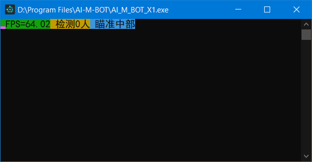
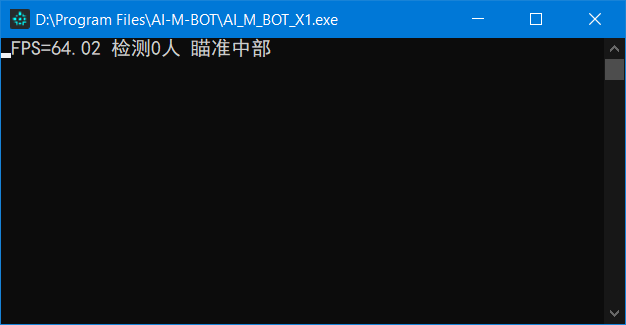

# AI-M-BOT

      

          

* 使用自瞄时请将游戏分辨率调整至**1600*900**及以下，将画面效果调整至**中等**及以下
* 需要计算能力6.1及以上版本的**N卡**以及安装相应驱动，详情请见[CUDA wiki](https://zh.wikipedia.org/wiki/CUDA)
* 按1或2或3选择极速模式或标准模式或高精模式(图像预测尺寸递增，预测速度递减)
* 等待游戏窗口成为当前活动窗口(点击一下游戏窗口即可)
* 按"i"键关效果展示，桌面左上角别区域小视频消失
* 按"o"键开效果展示，开启时桌面左上角会显示截屏识别区域小视频
* 按"1"/"2"键保持自瞄状态并控制鼠标
* 按"3"/"4"键保持自瞄状态但不控制鼠标
* 按"p"键重启程序
* 按"END"结束程序
* 自瞄只截屏识别准星附近区域，对于16:9的CF游戏窗口识别区域大小为(高=游戏窗口高*3/5，宽=高*4/3)
* 本程序使用python语言以及自源码编译的opencv-cuda加速库
* 本程序使用yolov4-tiny模型，只因其快(目前使用b站大佬[VeniVediVeci](https://space.bilibili.com/196421117)训练的权值)
* 本程序**很吃性能**，使用前请先确认您的电脑配置: [GPU天梯1](http://cdn.malu.me/gpu/)，[GPU天梯2](https://topic.expreview.com/GPU/)或[参考知乎](https://zhuanlan.zhihu.com/p/133845310)